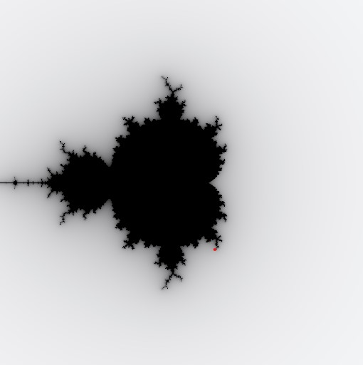
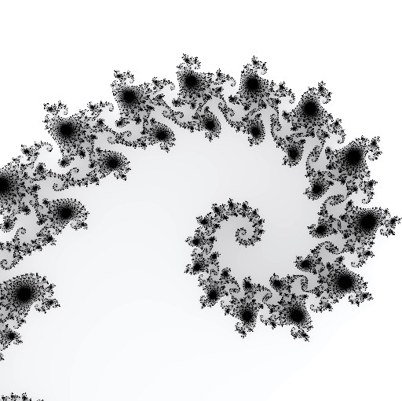

# Mandelbrot Viewer

A fun little app to generate the mandelbrot set and see it in python

Purpose of this project:

+ Learn about the mandelbrot set
+ Learn about complex numbers
+ Improve understanding of Python image rendering
+ Learn how to hook Python into Rust and utilize gpu rendering to improve performance!

